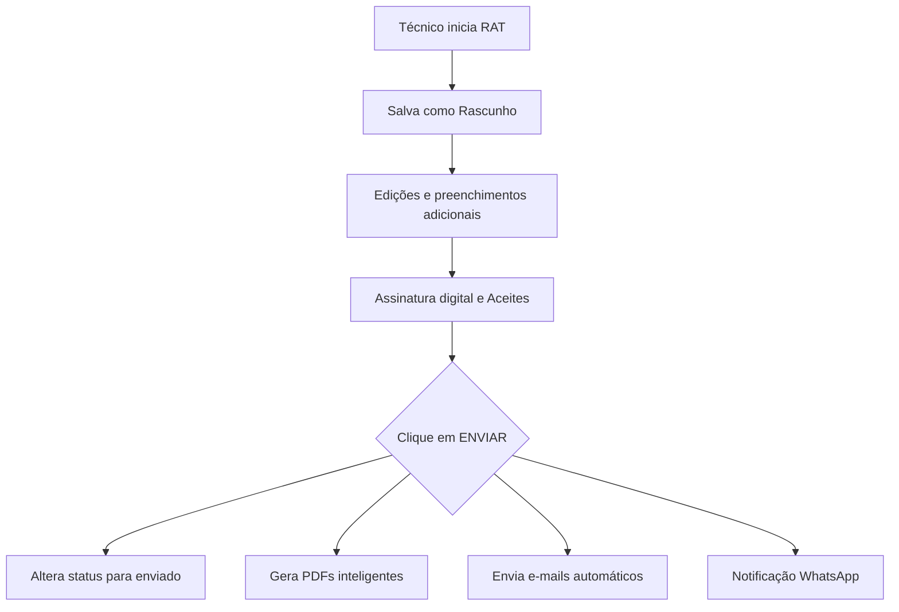

# 🛠️ Sistema RAT v2.5 - Guia de Setup, Uso e Estrutura (Madetech)

O **Sistema RAT (Relatório de Assistência Técnica)** é um sistema robusto em PHP e SQLite desenvolvido para substituir formulários legados (como JotForm), garantindo um controle refinado sobre os atendimentos realizados, geração automatizada de relatórios em PDF com assinaturas digitais em canvas, controle de despesas e múltiplos envios de e-mails para os setores envolvidos.

---

## 🚀 Setup Inicial & Configuração

### 1. Banco de Dados (SQLite)
O banco de dados SQLite (`data/rats.db`) é **auto-inicializável**. Na primeira execução do sistema, as tabelas de administradores, técnicos e relatórios são criadas de forma automática, bem como as migrações mais recentes de esquema.

> [!NOTE]
> A pasta `/data` possui proteção por `.htaccess` para impedir o acesso externo ao arquivo `.db`.

### 2. Configurações de SMTP & Credenciais
Todas as definições globais, credenciais de e-mail e constantes do banco residem em [api/config.php](file:///c:/Users/madet/Desktop/Marketing%20Madetech/Site%20Madetech%20Master/rats-mdt2026/api/config.php).

Atualmente está configurado para envio seguro via **Google Workspace (SMTP Gmail)**:
*   **Host SMTP**: `smtp.gmail.com`
*   **Porta**: `587` (TLS)
*   **Remetente**: `marketing@madetech.com.br`
*   **Destinatários Padrão**:
    *   Suporte Central: `suporte@madeparts.com.br`
    *   Marketing Central: `marketing@madetech.com.br`

---

## 📂 Estrutura Operacional

### Para o Administrador (/admin)
*   **Dashboard Geral**: Acesso e visualização em tempo real de todos os RATs emitidos. Filtros dinâmicos por técnico, status e mês.
*   **Gestão de Técnicos (CRUD)**: Criação, edição e exclusão de contas técnicas.
*   **Controle de Feedbacks**: Possibilidade de adicionar feedback técnico e de suporte a cada relatório.

### Para o Técnico (/tecnico)
*   **Dashboard Individual**: Visualização exclusiva de seus próprios relatórios.
*   **Criador de RATs**: Geração sequencial personalizada por técnico.
    *   *Formato*: `RAT-{ID_TECNICO_2_DIGITOS}-{SEQUENCIAL_4_DIGITOS}`
*   **Formulário Completo**:
    *   Dados do cliente, equipamento, modelo e garantia.
    *   Defeito constatado e detalhamento do trabalho executado.
    *   Tipos de serviço selecionáveis.
    *   Registro de **Turnos de Trabalho** e **Horas Viajadas** (com cálculos automatizados de horas).
    *   Registro detalhado de **KMs rodados** e **Despesas Adicionais** (Pedágio com quantidade, Alimentação com quantidade, Hospedagem em dias, e Despesas diversas).
    *   Upload de Notas Fiscais e comprovantes em JSON.
    *   **Assinatura Digital (Canvas HTML5)** do cliente (com Nome, Cargo e CPF) e do técnico.

---

## 📊 Fluxo de Emissão do RAT

### Versões dos PDFs e Destinatários
Ao finalizar o envio de um RAT, o sistema gera dinamicamente até 4 PDFs e os distribui por e-mail:
1.  **Completo**: Enviado para o e-mail do Técnico com todas as informações e despesas.
2.  **Suporte Central (`suporte@madeparts.com.br`)**: Sem os dados confidenciais de viagem/despesas pessoais do técnico.
3.  **Marketing (`marketing@madetech.com.br`)**: Cópia para arquivamento e validação de contatos.
4.  **Cliente**: Enviado para o e-mail do cliente (contendo apenas o escopo técnico do atendimento, sem informações de despesas internas, pedágios, quilometragem ou hospedagem).

---

## 🛠️ Tecnologias Utilizadas

*   **Backend**: PHP (estruturado, limpo e modularizado)
*   **Banco de Dados**: SQLite3 (embarcado, veloz e de baixíssima manutenção)
*   **Componente de E-mails**: PHPMailer (com suporte a SMTP TLS e anexos dinâmicos)
*   **Assinatura Digital**: HTML5 Canvas API integrada ao formulário
*   **PDF**: Suporte nativo à renderização inteligente do próprio navegador (Print-friendly) ou integração pronta para bibliotecas de renderização

---

## 🎯 Checklist para Deploy e Manutenção

- [x] Banco de dados auto-inicializado com migrations automáticas
- [x] Arquivo `.gitignore` devidamente configurado para proteger o arquivo SQLite e a pasta `vendor/`
- [x] SMTP configurado com credenciais seguras de App da Google Workspace
- [ ] Troca periódica das credenciais administrativas
- [ ] Backup periódico manual ou via API do arquivo `/data/rats.db`
